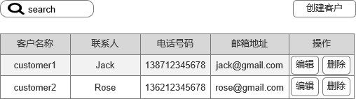
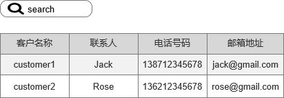

# 第2章 为Web应用添加业务功能

&emsp;提供一个“客户管理”模块，其中包含对客户的增删查改功能

[TOC]

## 2.1 需求分析与设计

### 2.1.1 需求分析
- (1) 当用户进入“客户管理”模块时，可通过列表方式来查看所有客户
- (2) 可通过“客户名称”关键字进行模糊查询
- (3) 单击客户列表中的“客户名称”连接，可查看客户基本信息
- (4) 单击客户列表中的“编辑”按钮，进入”新增客户界面“，可新增客户基本信息
- (5) 单机客户列表中的“编辑按钮”，进入”编辑客户“界面，可更新客户基本信息
- (6) 单击客户列表中的“删除”按钮，可删除当前所选择的客户，需提示是否删除

### 2.1.2 系统设计
**1. 设计用例**
- 查询用户
- 显示客户列表
- 显示客户基本信息
- 创建用户
- 编辑用户
- 删除客户

**2. 设计表结构**

| 字段名| 数据类型 |  是否非空| 字段描述|
| --- | --- | --- | --- |
| id| BIGINT |  是否非空| ID（自增主键）|
| name| VARCHAR(255) |  √ | 客户名称|
| contact| VARCHAR(255) |  √ | 联系人|
| telephone| VARCHAR(255) |  √ | 电话号码|
| email| VARCHAR(255) |  - | 邮箱地址|
| rmark| TEXT |  - | 备注|

**3. 设计界面原型**

**4. 设计URL**

| 序号| URL | 描述| 
| --- | --- | --- |
| 1 | GET：/customer | 进入“客户列表”界面 |
|  2| POST:/customer_search | 查询客户 |
| 3 | GET:/customer_show?id={id} | 进入“查看客户”界面 |
| 4 | GET:/customer_create | 进入“创建客户”界面 |
| 5 | POST:/customer_create | 创建客户 |
| 6 | GET:/customer_edit?id={id} | 进入“编辑客户”界面 |
| 7 |  PUT:/customer_edit?id={id}|  编辑客户|
| 8 | DELETE:/customer_delete?id={id} | 删除客户 |

### 2.2.2 准备开发环境
    idea
    maven 
    
### 2.2.3 编写模型层

### 2.2.4 编写控制器层
